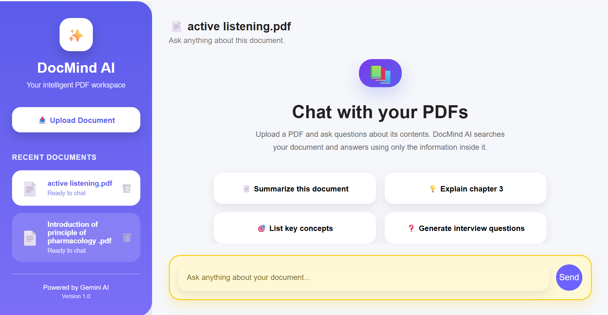
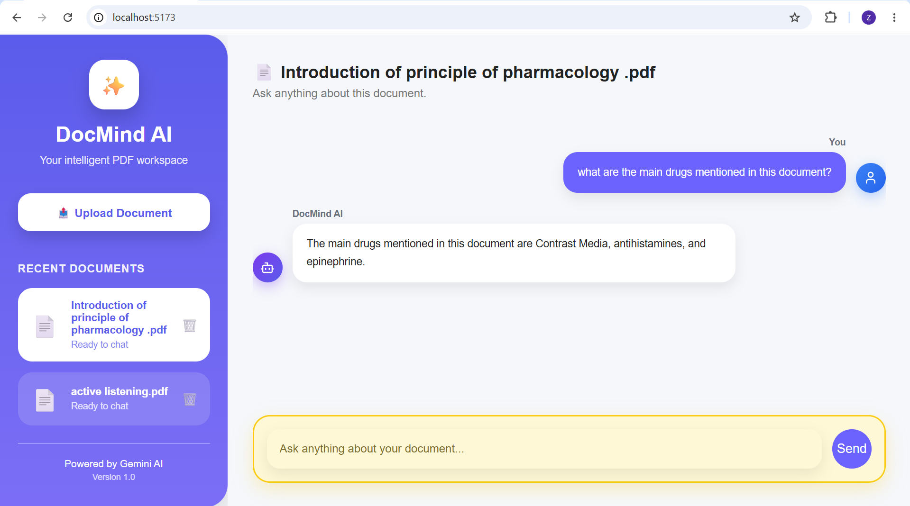
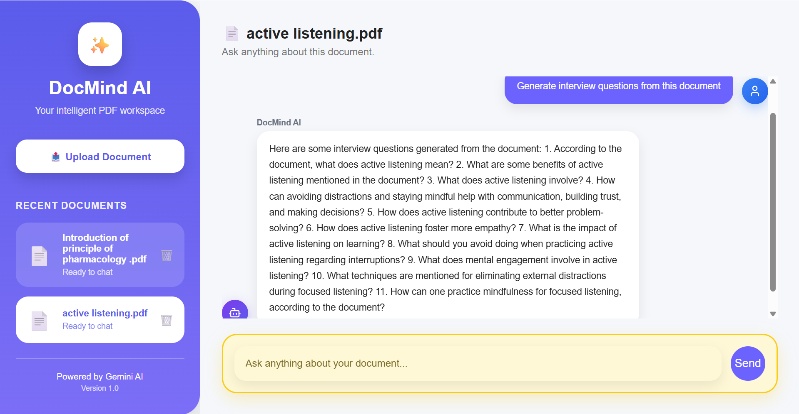
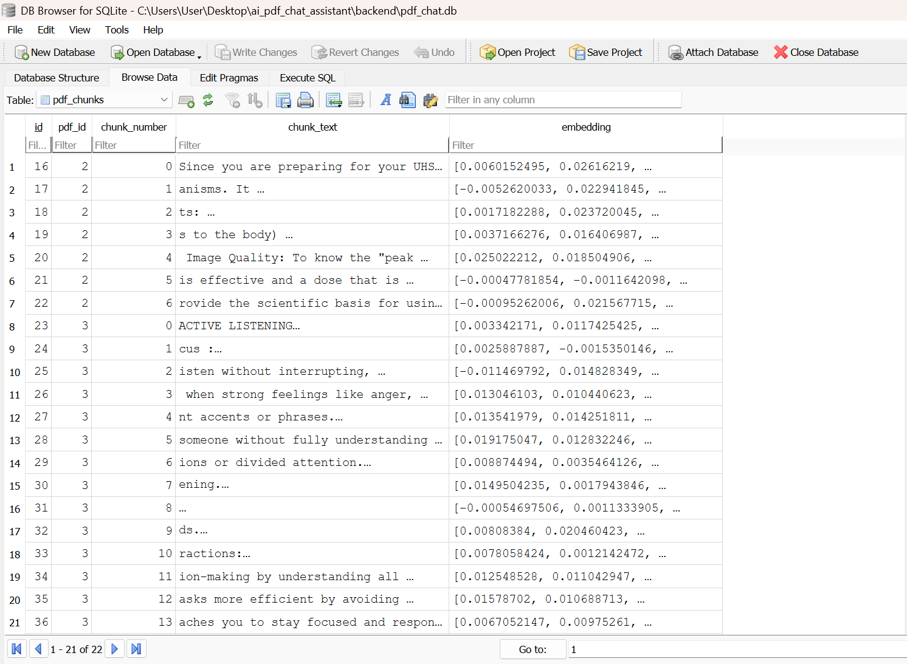

# 📄 DocMind AI – PaperPilot AI

**PaperPilot AI** is an AI-powered PDF question-answering application that enables users to upload PDF documents and ask questions about their contents using natural language. The application uses Retrieval-Augmented Generation (RAG), semantic search, embeddings, and Google's Gemini Large Language Model (LLM) to provide context-aware answers based on the uploaded document.

---

## 🚀 Features

* Upload PDF documents
* Extract and process document text
* Split documents into semantic text chunks
* Generate embeddings for document chunks
* Semantic search for relevant context
* Chat with PDFs using natural language
* Persistent chat history
* Manage uploaded documents
* Delete PDF documents
* Modern and responsive user interface

---

## 🛠️ Tech Stack

### Frontend

* React
* Axios
* CSS

### Backend

* FastAPI
* SQLAlchemy
* SQLite
* PyMuPDF

### AI

* Google Gemini API
* Google Gemini LLM
* Embeddings
* Retrieval-Augmented Generation (RAG)

---

## ⚙️ How It Works

1. Upload a PDF document.
2. Extract text from the PDF.
3. Split the text into smaller chunks.
4. Generate embeddings for each chunk.
5. Perform semantic search to retrieve the most relevant context.
6. Send the retrieved context together with the user's question to the Google Gemini LLM.
7. Return a context-aware answer based on the uploaded document.

---

## 📁 Project Structure

```text
paperpilot-ai/

│
├── backend/
│   ├── app/
│   ├── uploads/
│   ├── main.py
│   └── requirements.txt
│
├── frontend/
│   ├── src/
│   ├── public/
│   └── package.json
│
├── assets/
│   ├── 01.frontend.png
│   ├── 02.chat.png
│   ├── 03.response.png
│   └── 04.backend.png
│
├── .gitignore
└── README.md
```

---

## 📸 Screenshots

### 1. Frontend



---

### 2. Chat Interface



---

### 3. AI Response



---

### 4. Backend



---

## 💻 Installation

### Clone the Repository

```bash
git clone https://github.com/sahithigutti/paperpilot-ai.git
cd paperpilot-ai
```

### Backend

```bash
cd backend

python -m venv .venv
```

**Windows:**

```bash
.venv\Scripts\activate
```

Install the required packages:

```bash
pip install -r requirements.txt
```

Start the backend server:

```bash
uvicorn main:app --reload
```

### Frontend

Open another terminal and run:

```bash
cd frontend
npm install
npm run dev
```

---

## 🎯 Future Improvements

* Multiple document support in a single conversation
* User authentication
* Conversation export
* Streaming AI responses
* Cloud database integration
* Docker deployment

---


